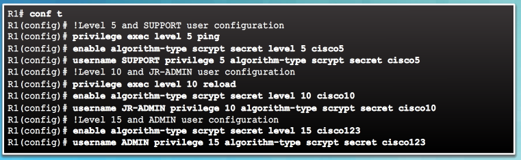
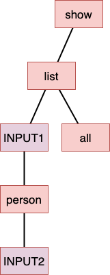

# CLI_Parser

I have been curious about how Cisco CLI works. Finally, thanks to Coronavirus, I found a time to dig into the question and try to understand what is going on inside Cisco user interface. You definitely have seen what Cisco CLI looks like.



Commands in CLI are implemented as n-aryl Tree. It means every node can have n number of children. So, commands are organized as hierarchy. For example, suppose a command like below:

```
show list [INPUT1] person [INPUT2]
show list all
```



Each node in the tree is called **param**. Params at the first level of the overall command tree is called **hooks**. Params are categorized into two groups:

1. **command params**: constant keywords in the graph (like show, list, all, person)

2. **leaf params**: denotes to user input in the graph (like INPUT1, INPUT2).

There are also incomplete commands when the user traverse each path of the tree. For example,
``show list ``
is incomplete and the program should recognize between complete and incomplete commands. In addition, a node cannot have two or more than two leaf params as its children. Generally, the CLI parser should have following responsibilities:

* Validate command syntax
* Validate leaf values are compatible with leaf expectatoin
* Send command to backend/application along with the leaf values for command processing.
* Provide handy and easy method to developer to modify/extend or add more commands
* provide shortcuts to user to speed up the work.
